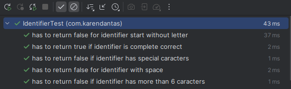

# Programa identifier

Identifier recebe uma série de caracteres, e retorna se é um identificador válido.

## 1. Classes de equivalência
- Entrada deve ter mais de 1 caractere e menos de 6 
- Deve começar com letra
- Somente letras e números

## 2. Valor limite
- Cumprimento: (>= 1 e <= 6)
- Caracteres permitidos a-z, A-Z, 1-9

## Tabela de casos de teste

| Caso de Teste | Entrada              | Resultado Esperado | Descrição                                                                              |
|---------------| -------------------- | ------------------ | -------------------------------------------------------------------------------------- |
| CT01          | `"1S43"`             | `false`            | Identificadores devem começar com uma letra.                                           |
| CT02          | `"1S4 3"`            | `false`            | Não deve haver espaços em identificadores.                                             |
| CT03          | `"sndjfks4123sjifd"` | `false`            | O tamanho máximo permitido é 6 caracteres.                                             |
| CT04          | `"abcdef"`           | `true`             | Identificador correto: começa com letra, sem espaços, <= 6 caracteres e sem especiais. |
| CT05          | `"ab&%$ef"`          | `false`            | Caracteres especiais não são permitidos.                                               |

## Como executar os testes

1. Ter maven instalado
2. Adicionar JUnit dependecies no POM.xml
    ```bash
         <dependencies>
        <dependency>
            <groupId>org.junit.jupiter</groupId>
            <artifactId>junit-jupiter</artifactId>
            <version>5.12.2</version>
        </dependency>
    </dependencies>
   ```
3. Compilar testes
    `mvn test`

4. Rodar
`Cntrl+shift+f10 `
## Testes
